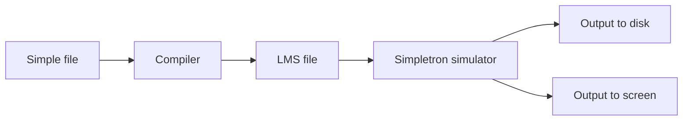

# SIMPLE language and LMS

Reference material from P. J. Deitel & H. M. Deitel, *C How to Program* (Simple / Simpletron / compiler exercises).

## SIMPLE language

> Before we begin to build the compiler, we will explain a simple but powerful high-level language, similar to early versions of the popular BASIC language. We call this the *Simple* language. Every Simple instruction consists of a line number and the Simple instruction itself. Line numbers must appear in ascending order. Each instruction begins with one of the following Simple commands: `rem`, `input`, `let`, `print`, `goto`, `if…goto`, or `end`. All commands except `end` may be used repeatedly. Simple evaluates only integer expressions using the operators `+`, `-`, `*`, `/` and `%`. These operators have the same precedence as in C. Parentheses may be used to change the order of evaluation of an expression.
>
> Our Simple compiler recognizes only lowercase letters. All characters in a Simple file must be lowercase (uppercase letters cause a syntax error unless they appear in a `rem` statement, in which case they are ignored). A variable name is a single letter. Simple does not allow descriptive variable names, so variables should be explained in comments to indicate their use in the program. Simple uses only integer variables and has no variable declarations; merely mentioning a variable name in a program causes that variable to be declared and initialized to zero automatically. Simple’s syntax does not allow string manipulation (reading, writing, comparing strings, and so on). If a string is found in a Simple program (after a command other than `rem`), the compiler generates a syntax error.

 **Simple instructions:**

| Command   | Example instruction        | Description                                                                                                                                           |
| --------- | -------------------------- | ----------------------------------------------------------------------------------------------------------------------------------------------------- |
| `rem`     | `50 rem this is a comment` | Any text after `rem` is for documentation only and is ignored by the compiler.                                                                        |
| `input`   | `30 input x`               | Displays a question mark to prompt the user to enter an integer. Reads that integer from the keyboard and stores it in `x`.                           |
| `let`     | `80 let u = 4 * (j - 56)`  | Assigns to `u` the value of `4 * (j - 56)`. An arbitrarily complex expression may appear to the right of the equals sign.                             |
| `print`   | `10 print w`               | Displays the value of `w`.                                                                                                                            |
| `goto`    | `70 goto 45`               | Transfers program control to line `45`.                                                                                                               |
| `if…goto` | `35 if i == z goto 80`     | Compares `i` and `z` for equality and transfers control to line `80` if the condition is true; otherwise execution continues with the next statement. |
| `end`     | `99 end`                   | Terminates program execution.                                                                                                                         |

> — P. J. Deitel & H. M. Deitel, *C How to Program* (the Simple language / Simpletron compiler exercise).

## LMS

> We are going to create a computer that we will call the Simpletron. As its name implies, it is a simple machine, but as we will soon see, it is also powerful. The Simpletron runs programs written in the only language it understands directly: Simpletron Machine Language, or SML (LMS in the Spanish edition).
>
> The Simpletron contains an *accumulator*, a special register in which information is placed before the Simpletron uses that information in calculations or examines it in various ways. All information in the Simpletron is handled in *words*. A word is a signed four-digit decimal number, such as `+3364`, `-1293`, `+0007`, `-0001`, and so on. The Simpletron is equipped with `100` words of memory, and these words are referenced by location numbers `00`, `01`, …, `99`.
>
> Before an SML program can be executed, we must *load*, or place, the program into memory. The first instruction of every SML program is always placed in location `00`. Each instruction written in SML occupies one word of the Simpletron’s memory (so instructions are four-digit decimal numbers). We will assume that the sign of an SML instruction is always positive, although the sign of a data word may be either positive or negative. Each location in the Simpletron’s memory may contain an instruction, a data value used by a program, or an unused (and therefore undefined) memory area. The first two digits of each SML instruction are the *operation code* that specifies the operation to be performed. The last two digits are the *operand*, the address of the memory location containing the word to which the operation is applied.

 **Simpletron Machine Language (SML) operation codes.**

| Code | Name | Example | Description |
| --- | --- | --- | --- |
| `10` | `READ` | `+10008` | Read a word from the terminal and store it in location `008`. |
| `11` | `WRITE` | `+11008` | Write the word in location `008` to the terminal. |
| `12` | `READ_STR` | `+12008` | Read a string from the terminal and store it starting at location `008`. |
| `13` | `WRITE_STR` | `+13008` | Write the string stored at location `008` to the terminal. |
| `14` | `PUT_NEWLINE` | `+14008` | Write a newline to the terminal. |
| `20` | `LOAD` | `+20008` | Load the word in location `008` into the accumulator. |
| `21` | `STORE` | `+21008` | Store the accumulator into location `008`. |
| `30` | `ADD` | `+30008` | Add the word in location `008` to the accumulator; the result stays in the accumulator. |
| `31` | `SUBTRACT` | `+31008` | Subtract the word in location `008` from the accumulator; the result stays in the accumulator. |
| `32` | `DIVIDE` | `+32008` | Divide the accumulator by the word in location `008`; the result stays in the accumulator. |
| `33` | `MULTIPLY` | `+33008` | Multiply the accumulator by the word in location `008`; the result stays in the accumulator. |
| `34` | `MODULE` | `+34008` | Store in the accumulator the remainder of the accumulator divided by the word in location `008`. |
| `35` | `POWER` | `+35008` | Raise the accumulator to the power of the word in location `008`. |
| `40` | `BRANCH` | `+40008` | Jump to location `008`. |
| `41` | `BRANCHNEG` | `+41008` | Jump to location `008` if the accumulator is negative. |
| `42` | `BRANCHZERO` | `+42008` | Jump to location `008` if the accumulator is zero. |
| `43` | `HALT` | `+43000` | Halt; the program has completed its task. |
| `50` | `END` | `+50000` | Halt in this implementation (`END` instead of `HALT` `43`). |

> — P. J. Deitel & H. M. Deitel, *C How to Program* (Simpletron / SML exercise).

 This project’s VM (`src/lms.c`) uses `1000` memory locations.

## Compiler

> **12.27 (Building a Compiler.)** Now that the Simple language has been introduced, we will explain how to build our Simple compiler. First consider the process by which a Simple program is converted to LMS and executed by the Simpletron simulator (see flowchart below). A compiler reads a file containing a Simple program and converts it to SML code. The LMS code is written to a disk file, one LMS instruction per line. Then the LMS file is loaded into the Simpletron simulator, and the results are written both to a disk file and to the screen.

 **Writing, compiling, and executing a Simple program.**

> — P. J. Deitel & H. M. Deitel, *C How to Program* (exercise 12.27, Building a Compiler).

